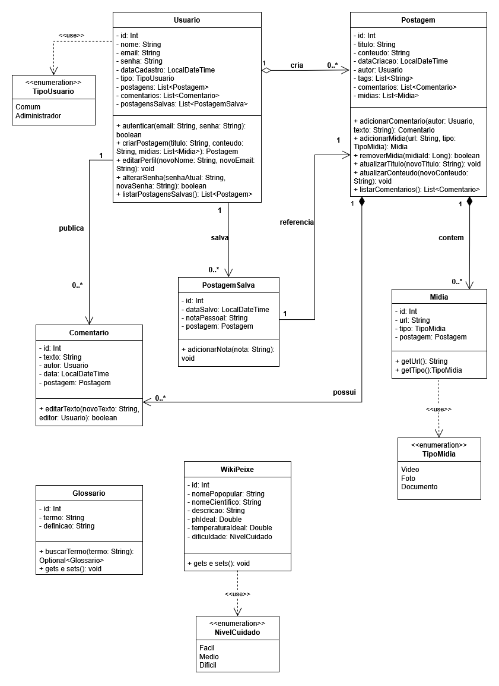
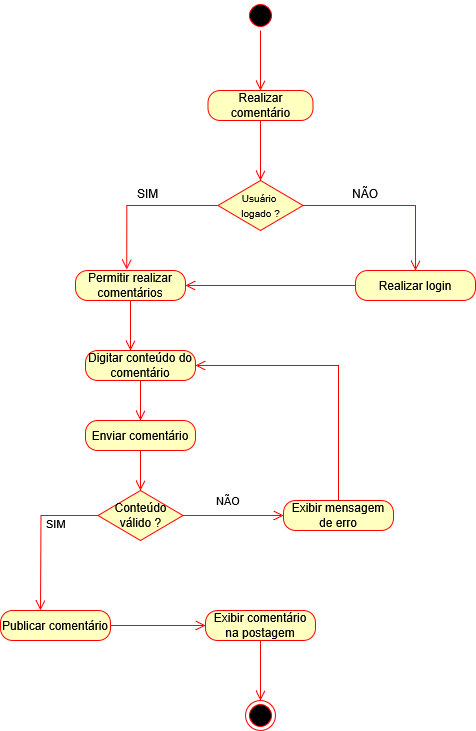
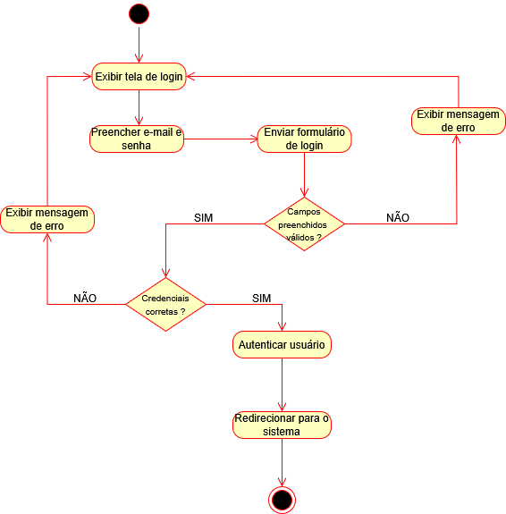
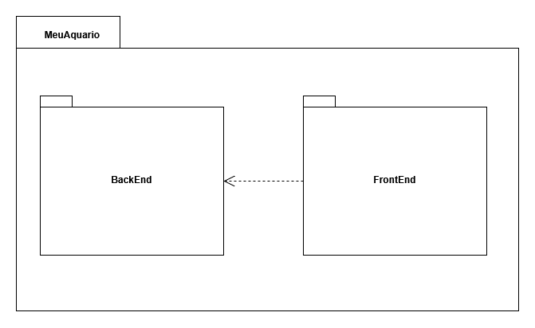
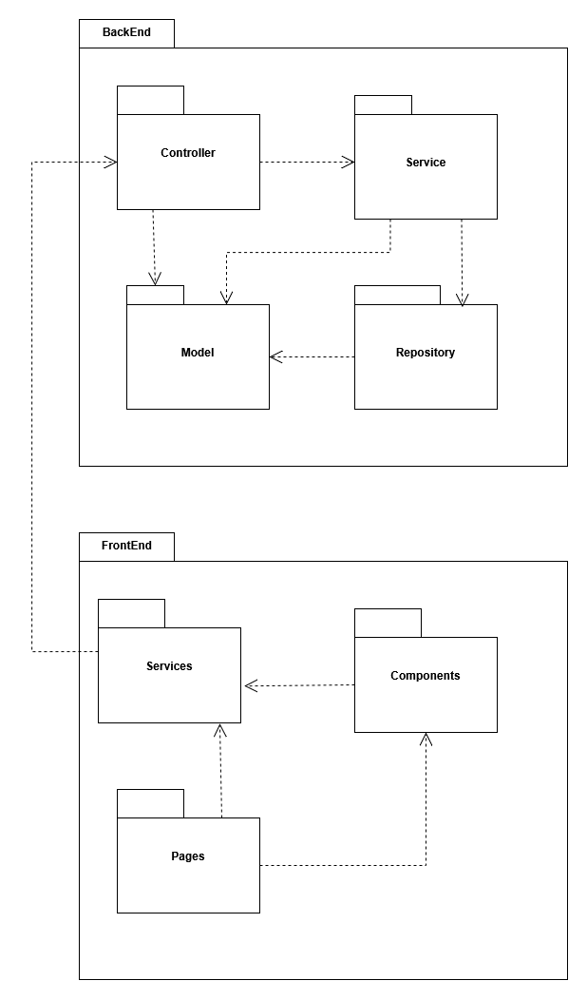
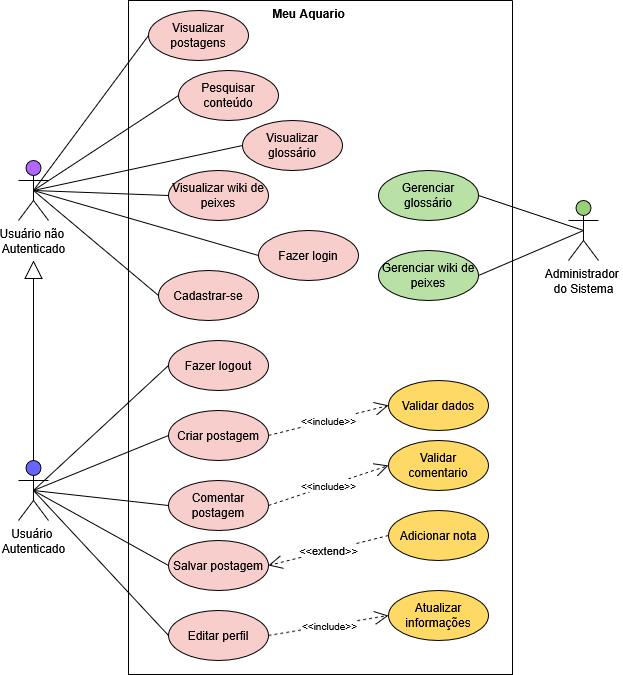

# Meu Aquário

**Código da Disciplina**: FGA0208 
**Número do Grupo**: 08 
**Entrega**: 02 

## Aluno(s)
|Matrícula | Aluno |
| -- | -- |
| 19/0085045  |  Brenno da Silva Oliveira |
<table style="width: 100%;">
  <tr>
    <td align="left">
      <a href="https://github.com/Brenno-Silva01">
         
        <b>Brenno da Silva</b>
      </a>
    </td>
</table>

## Sobre 
**Meu Aquário** é um espaço digital para entusiastas do aquarismo compartilharem suas experiências, trocarem conhecimentos e conferir dicas sobre a manutenção e criação de aquários. A proposta é criar uma comunidade interativa que una novatos e veteranos do hobby.

Este repositório reúne toda a documentação do projeto referente a Desenho de Software(Modelagem).

## Screenshots da Segunda Entrega

<h2 align="center">Diagrama de Classes</h2>

    

<em> Imagem 01 - Diagrama de Classes </em>

---

<h2 align="center">Diagramas de Atividade</h2>

    

<em>Imagem 02 - Fluxo de comentário em uma postagem</em>

    

<em>Imagem 03 - Fluxo de comentário em uma postagem</em>

    

<em>Imagem 04 - Fluxo de autenticação de usuário</em>

--- 

<h2 align="center">Diagramas de Pacotes</h2>

    

<em>Imagem 05 - Pacote geral do sistema com frontend e backend</em>

    

<em>Imagem 06 - Estrutura interna dos pacotes frontend e backend</em>

---

<h2 align="center">Diagrama de Casos de Uso</h2>

    

<em>Imagem 07 - Diagrama de Casos de Uso do sistema Meu Aquário</em>

---

## Há algo a ser executado?

( ) SIM

(**X**) NÃO

---

## Informações Complementares 
- O projeto foi inicialmente planejado para ser desenvolvido em grupo, porém, devido à contratempos, foi executado individualmente por [Brenno Silva](https://github.com/brenno-silva01).
- Todas as etapas foram realizadas com dedicação: Modelagens (UML), documentação em GitPages, estruturação da arquitetura e repalnejamento.
- A modelagem seguiu o padrão MVC e está alinhada com as tecnologias que serão implementadas (Spring + Angular).
- A documentação foi desenvolvida utilizando Markdown e organizada com o auxílio da ferramenta Docsify para facilitar a navegação e leitura dos artefatos.
- Todas as imagens dos diagramas foram construídas no draw.io e versionadas dentro do repositório.
